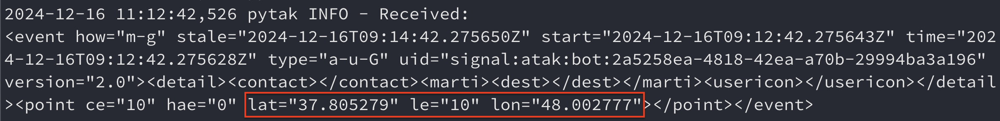

# Signal-TAK Integration Bot

A Python service that integrates Signal Messenger and TAK server for geolocation message sending. It is designed to be deployed on a cloud provider and scaled to handle a large number of messages.

The service integrates Signal messages:  


CoT messages sending to public TAK server:  


During the development process, I've struggled with the TAK server integration. At first, I've tried to setup a TAK server locally using [FreeTAKServer](https://github.com/FreeTAKTeam/FreeTakServer). Then - remotely, but also without success. Also, I couldn't find a good solution to mimic a TAK server on my machine. After that, I switched to [public TAK server](https://www.reddit.com/r/ATAK/wiki/index/community-servers/) (`137.184.101.250`), which I used for testing. But this public server is not processing messages from my custom TAK client correctly (see the image below). Unfortunately, I didn't manage to overcome the issue with custom TAK client.


So I've decided to use [pytak library](https://github.com/snstac/pytak) to send CoT messages to public TAK server. It is working as expected, but it's not flexible and secure enough. Library code is poor and not well-documented. So the next step is to implement custom TAK client to take control of CoT messages sending for more flexibility and security.

After numerous of attempts to resolve all the issues with TAK server, I've decided to use [dockerized Signal REST API](https://github.com/bbernhard/signal-cli-rest-api) to spend less time on this integration. Although it's working as expected, it's not flexible and secure enough. So the next step would be to consider the pros and cons of developing internal solution for Signal integration.

## Features

- ✨ Signal Messenger REST API client
- 🌍 TAK server integration with CoT protocol
- 📬 Redis-based message queuing
- 🐳 Docker containerization
- 🚀 CI/CD with GitHub Actions

## Requirements

- Python 3.10+
- Redis 7+
- Signal Messenger account
- TAK server access
- Docker and Docker Compose

## Project Roadmap for future development
1. Implement receiving geolocation messages from external sources
2. Setup or use existing private TAK server with proper configuration
3. Test pytak client with private TAK server to ensure compatibility
4. Complete custom TAK client to take control of CoT messages sending for more flexibility and security
5. *(Optional)* Implement custom Signal client to take control of Signal messages sending for more security
6. Deploy the service to a cloud provider and setup scaling rules
7. Develop a comprehensive monitoring system for the service

## Quick Start

1. Clone the repository:
```bash
git clone https://github.com/yourusername/signal-tak-bot.git
cd signal-tak-bot
```

2. Configure environment:
```bash
cp .env.example .env
# Edit .env with your configuration
```

3. Start with Docker:
```bash
docker-compose up -d
```

## Configuration

### Signal Configuration
```env
SIGNAL_PHONE_NUMBER="+1234567890"
SIGNAL_API_URL="https://signal-api.example.com"
SIGNAL_RECIPIENTS="+1987654321,+1234567899"
```

### TAK Server Configuration
```env
TAK_SERVER_URL="tak-server.example.com"
TAK_SERVER_PORT=8087
```

## Usage

### Send Location Message
Format: `<longitude> <latitude> <description>`
Example: `-74.0060 40.7128 Tank in Manhattan`

### Monitor Logs
```bash
docker-compose logs -f
```

### Check Service Status
```bash
docker-compose ps
```

## Development

### Setup Development Environment
```bash
# Create virtual environment
python -m venv venv
source venv/bin/activate  # Linux/Mac
# or
.\venv\Scripts\activate  # Windows

# Install dependencies
pip install -r requirements.txt
pip install -r requirements-dev.txt
```

### Run Tests
```bash
pytest
```

### Code Quality
```bash
# Format code
black signal_bot tests

# Run linting
pylint signal_bot tests

# Type checking
mypy signal_bot tests
```

## Project Structure

```
signal_bot/
├── __init__.py
├── models.py           # Data models
├── signal_client.py    # Signal REST API client
├── tak_client.py       # Custom TAK client
├── pytak_client.py     # PyTAK client implementation
├── cot_formatter.py    # CoT Protocol formatter
├── redis_client.py     # Redis client
├── config.py           # Configuration
├── exceptions.py       # Exceptions
├── logging_config.py   # Logging configuration
└── test_app.py         # Test application
```

## Documentation

- [Installation Guide](docs/installation.md)
- [Usage Guide](docs/usage.md)
- [API Documentation](docs/api.md)
- [Architecture](docs/architecture.md)

## Acknowledgments

- [Signal Messenger API](https://signal.org/docs/)
- [TAK Protocol Documentation](https://www.tak.gov/)
- [PyTAK Library](https://github.com/snstac/pytak)
- [Redis Documentation](https://redis.io/docs/)
