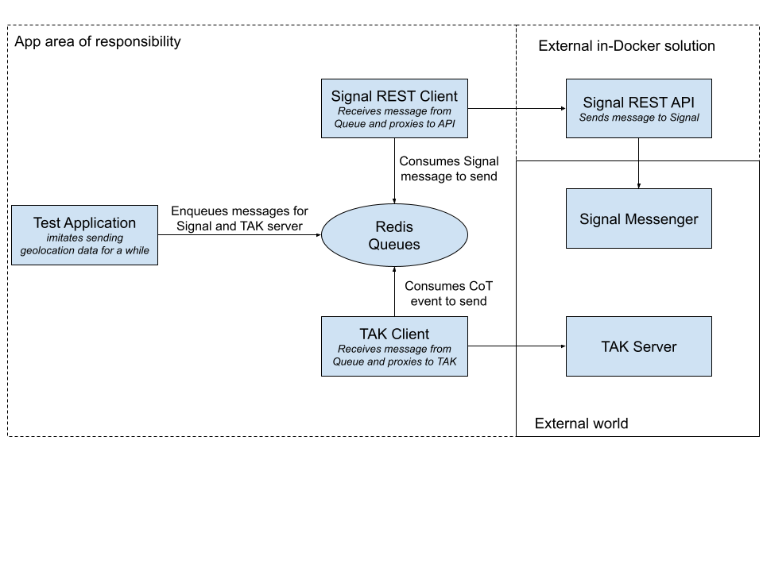

# Architecture Documentation

## Overview

The Signal-TAK Bot is designed using clean architecture principles, implementing async I/O operations and message queuing for reliable message delivery.

## Core Components

### 1. Signal Client
- Handles Signal Messenger REST API communication
- Implements async HTTP client using aiohttp
- Manages message sending with retry mechanism
- Handles connection state and reconnection

### 2. TAK Client
- Manages TAK server connections
- Handles async TCP communication
- Provides connection recovery

### 3. PyTAK Client
- Alternative TAK implementation using pytak library
- Built-in protocol compliance
- Proven compatibility with TAK servers

### 4. CoT Formatter
- Implements CoT protocol
- Formats messages according to XML schema
- Manages event types and attributes
- Ensures protocol compliance

### 5. Redis Client
- Implements message queuing
- Handles message persistence
- Manages failed message retry

## Data Flow Diagram

